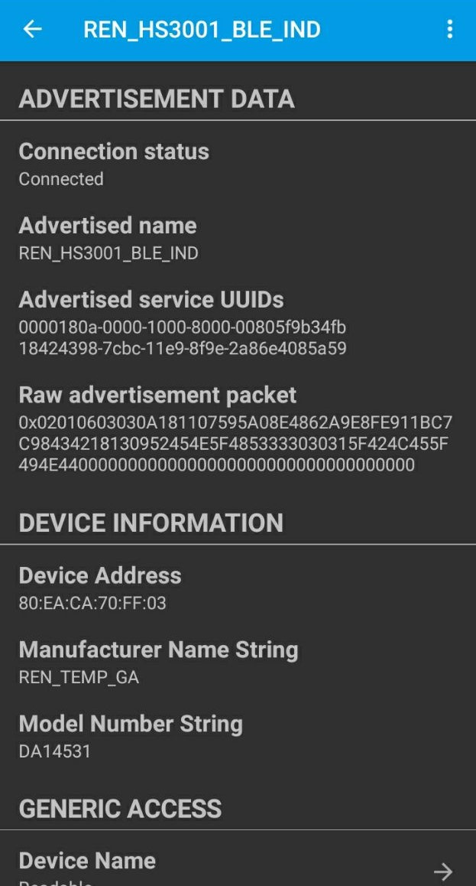
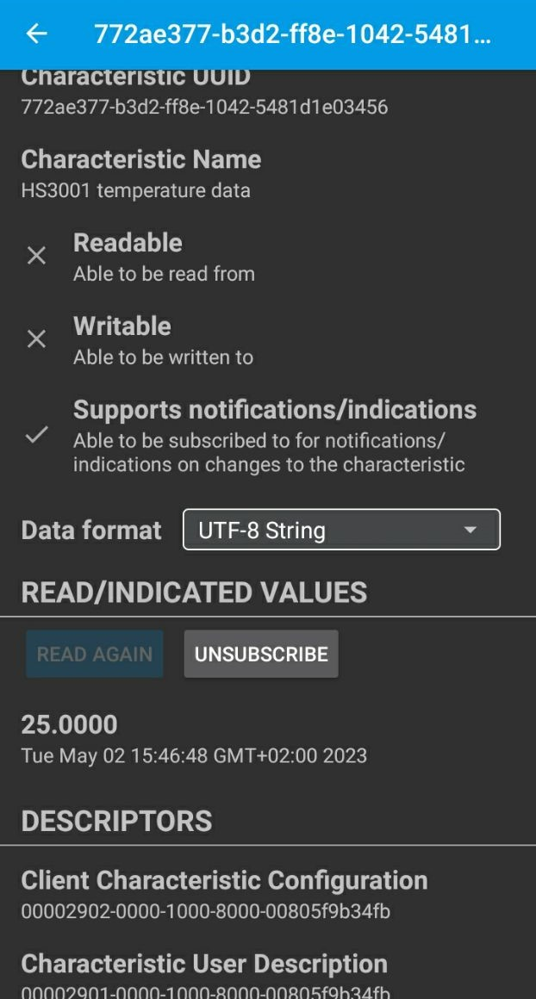

# ble_indication_hs3001


## Example description

This example shows:
- How to use I2C to read HS3001 temperature register.
- How to use I2C to write HS3001 humidity register.
- This example uses the [HS3001 High-Performance Relative Humidity and Temperature Sensor ](https://www.renesas.com/us/en/products/sensor-products/humidity-sensors/hs3001-high-performance-relative-humidity-and-temperature-sensor) from Renesas.
- How to create a custom profile for two or more services.
- How to configure DA14531 as peripheral indicator(GATT indication)


# GAP & GATT
It's critical to understand the differences between GAP and GATT.

The general topology of the BLE network stack is specified by GAP.
Once devices have a dedicated connection, GATT goes into great detail about the transfer of attributes (data).
GATT specifically concentrates on how data is packaged, structured, and delivered in accordance with its specified criteria. 
The Attribute Protocol (ATT), which GATT directly sits on top of in the BLE network stack, is closely linked with ATT. 
In fact, GATT employs ATT to explain how data is sent between two connected devices.

## Generic Access Profile (GAP)

A BLE device can connect or broadcast in order to communicate with other BLE devices and the outside world. Generic Access Profile (GAP) rules must be followed when using these techniques. 
GAP specifies how two devices can directly interact with one another and how BLE-enabled devices can make themselves available.

By embracing the roles listed in GAP, a device can join a BLE network:

## Broadcasting 
  The transmission of data between these roles does not require an explicit connection.

 .broadcaster:A device that broadcasts advertising data packets to the general public, such as how long a button has been depressed, is a broadcaster.
    An observer is a device that listens to the information sent by the broadcaster in the advertising packets. The broadcaster and the viewer have no interaction.

 .observer:A gadget that monitors the information contained in the advertising packets transmitted by the broadcaster. The broadcaster and the observer don't interact at all.

## Connecting 

 For the purpose of data transfer, these roles must explicitly connect and shake hands. Compared to broadcasting roles, these roles are more frequently used.
 A peripheral device is one that broadcasts its presence so that connected central devices can establish communication. After connecting, peripherals continue to be linked to the central device that approved the connection request and stop broadcasting data to other central devices.
 As they only need to send beacons occasionally, peripherals are low-power devices. Communication with peripherals is initiated by central devices.

 Central, An apparatus that, after listening to the advertising packets, connects to a peripheral apparatus. Many different peripheral devices can connect to a central device.
A request connection data packet is sent to the peripheral device by the central device when it wishes to connect. A connection is made if the peripheral device agrees to the request from the central device.

# Generic Attribute Profile (GATT)

There are specific roles that interacting devices can take, similar to GAP:

Client: Typically makes a request to the GATT server. The client has the ability to read and/or write characteristics stored on the server.
Server: Storing characteristics is one of the server's primary functions. The server must make the characteristics available after the client submits a request.


## HW and SW configuration

This example runs on the BLE Smart SoC (System on Chip) devices:
- DA14531 daughter board + DA145xxDEVKT-P PRO-Motherboard.

The user manuals for the development kits & HS3001 can be found:
- [Here](https://www.renesas.com/eu/en/document/mat/um-b-114-da14531-development-kit-pro-hardware-user-manual) for the DA145xxDEVKT-P PRO-Motherboard.
- [Here](https://www.renesas.com/eu/en/document/mat/um-b-117-da14531-getting-started-pro-development-kit-html-chinese) for getting started with Pro Development kit.
- [Here](https://www.renesas.com/us/en/document/dst/hs300x-datasheet) for HS3001.


## HS3001 pin configuration:

In `user_periph_setup.h` you can check the following configuration for I2c.It is also possible to modify according to your needs:

```c
#define I2C_SLAVE_ADDRESS           0x44                   // Set slave device address
#define I2C_SPEED_MODE              I2C_SPEED_FAST        // Speed mode: 	I2C_SPEED_FAST (400 kbits/s)
#define I2C_ADDRESS_MODE            I2C_ADDRESSING_7B     // Addressing mode: I2C_ADDRESSING_7B
#define I2C_ADDRESS_SIZE            I2C_1BYTES_ADDR       // Address width: 	I2C_1BYTE_ADDR 

```
## Hardware configuration:
Regarding following figure you can connect the sensor to the development board.


In the same header file you can see the following configuration for HS3001:

```c

#define HS3001_SCL_PORT            GPIO_PORT_0
#define HS3001_SCL_PIN	           GPIO_PIN_6
#define HS3001_SDA_PORT            GPIO_PORT_0
#define HS3001_SDA_PIN             GPIO_PIN_7

```

## How to run the example

### Setup
For the initial setup of the project that involves linking the SDK to this SW example, please follow the Readme [here](../../Readme.md).

1. Start Keil using the `ble_app_indication_HS3001.uvprojx` Keil project file.

2. Expand the dialog shown in the red box in the image below.


3. Select your device: DA14531, DA14586 or DA14585.
		


## Expected Results

1. Open the BLE scanner app and look for "REN_HS3001_BLE_IND".

2. Connect to the device.

3. Subscribe to the indication.

If everything went well, you should be able to receive temperature & humidity data as the value of the custom characteristic whenever there is a change in the values, as shown in the image below.

You can use different software on your phone to connect and receive the data. For example:
[GATTBrowser](https://play.google.com/store/apps/details?id=com.renesas.ble.gattbrowser&hl=en_US)
[LightBlue](https://play.google.com/store/apps/details?id=com.punchthrough.lightblueexplorer&hl=nl)
or
[SmartBond](https://play.google.com/store/apps/details?id=com.renesas.smartbond&hl=it&gl=US)

#In the figure you can see the expected result on GATTBrowser and Lightblue
when you turn on your Bluetooth device you can find the advertisement for Bluetooth under the name of 'REN_HS3001_BLE_IND'.


if you turn on the indication you can receive data as soon as there is a change.


On LightBlue you can also see the advertisement for Bluetooth


if you scroll down you see temperature and humidy :


for each services you can subscribe and receive the data whenever there is a change:



## Example description

you can find custom profile Tutorial on the [Renesas support](http://lpccs-docs.dialog-semiconductor.com/tutorial-custom-profile-DA145xx/introduction.html 
) by this you can make your own custom profile. The **user_catch_rest_hndl** function in `user_peripheral.c` will handle the messages for our custom profile. 
There are two possible custom services for this application: write to the indicator. The **user_temperature_message_handler** or **user_humidity_message_handler** function is called whenever there is a change in temperature or humidity. 
This function will examine the write's content. The temperature timer is terminated if the content of the write is equal to zero. If the value is different, a timer is created that calls **user_send_temperature_ind** or **user_send_humidity_ind** after INDICATION_DELAY ms. 
The sensor data will be read out and converted to a string (for demonstration purposes) using the **user_send_temperature_ind** or **user_send_humidity_ind** functions.
Along with some other parameters, such as the connection ID, the string will be included in a message and the characteristic handle. 
After the message is sent, the app_easy_timer function is used to schedule the next call to  **user_send_temperature_ind** or **user_send_humidity_ind** function. This will ensure the temperature or humidity is transmitted regularly and after each change the user will receive an indication. The `app_easy_timer`function
has a resolution of 10ms hence we divide the desired delay in ms by 10. 
